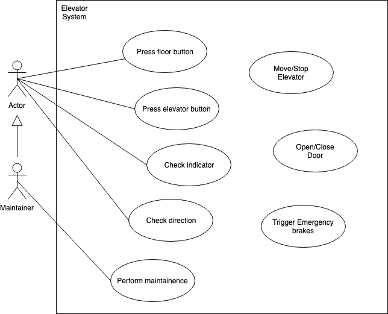
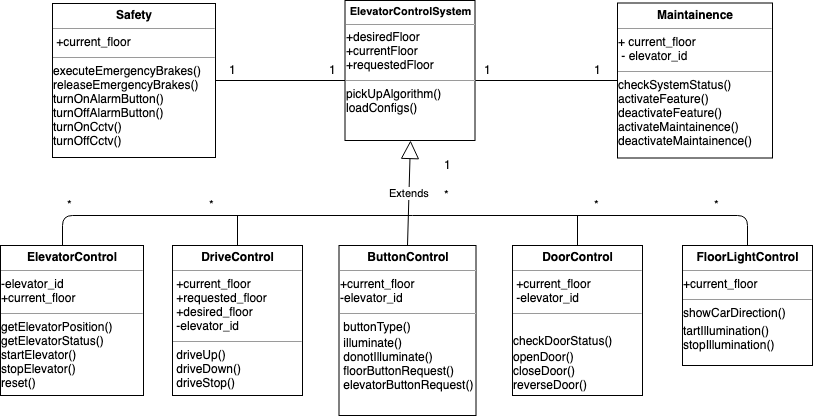

## Elevator System Design.

### Usecase Diagram for Elevator System

The diagram mentioned above depicts the following use cases for an Elevator System.

**Actors:**

- Elevator system would consist of two actors passenger and maintainer
- The maintainer does the same tasks as a user but additionally performs maintenance tasks

**Usecases:**

- PressFloorButton: The passenger in this use case presses the floor button requesting an elevator
- PressElevatorButton: The passenger here uses buttons inside elevator to select the floor they would like to go on
- CheckIndicator: The passenger checks indicator to see if the intended floor has arrived or not
- CheckDirection: The passenger checks the direction of lift from lobby, floors and from inside of the elevator

**Environment controlled:**
- EmergencyBrakes: The passenger can apply for emergency stop
- PerformMaintainence: The maintainer performs maintenance tests on the elevator

Therefore, the use case diagrams states that the passenger/maintainer is interacting with Elevator system by making elevator class and decide get on/off depending on indications from the system.

### Class Diagram for Elevator System (Software Architecture View)

This diagram is used to portrait the object-oriented side of system which is scalable and efficient. It tries to give a static view of whole system at once.

In the class diagram, all the control objects are derived from the superclass `ElevatorControlSystem`. The control objects share (some of) the property of `ElevatorControlSystem`, and has its attributes and operations used for the object it controls.

- `DoorControl` controls a `DoorControl` object controls the action of DoorMotor; there are two 'DoorMotors' on each elevator. `DoorMotor` can be commanded to open, close, or make a door reversal.
- `DriveControl` controls the elevator Drive, which acts as the primary motor moving the car up and down, and stopping at floors when necessary.
- `FloorLightControl` is in the number of two on each floor; each indicates the current moving direction of the elevator.
- `ButtonControl` is one for each floor and in the elevators. The `ElevatorButtonControl` accepts `ElevatorRequestButton` calls and is in charge of turning on/off the corresponding elevator call lights.
- `ElevatorControl` controls elevator actions like start, stop and reset elevators, also the `ElevatorPositionIndicator/Status` helps passengers to know the current position of the elevator.
- `Safety` and `Maintenance` are also an environmental object, which does not belong to the control software but is an important part of the system. In the real world, the safety and maintenance actions vary.

- **What’s the most effective way to move people?**

  - The most effective way will be have an efficient algorithm like having separate queues for up and down requests or implement priority queues or heap queue.

- **How will your system scale?**

  - The system as showed in the class diagram will scale horizontally - the requests will be handled by respective control classes which manage the object
  - where there can more than ``ElevatorControlSystem`` class to scale vertically.
  - The having separate control classes will avoid issues like computing shortage, single point of failure and underutilized resources

- **What can fail? How will your system recover?**

  - The elevator system is can be prone to a various issues:
    - power outages:  it is important to have a backup power supply for each elevator so that it can safely reach nearest floors
    - Button/indicator or external hardware device failures: buttons and indicator failure can be human-made or natural; therefore, it is suggested that each button/indicator are replaced as an when possible. This can also lead to users breaking the button/indicators while they attempt to fix it on their own which can also may lead to issues with other system devices.
    - sensor failures : sensor failures are critical for elevator to open/close doors and to stop therefore it is important that the maintainence of sensors are done on regular basis
  One can recover from all the above issues by making sure that the elevator is bought from a certified authority with all safety certificates and manuals - users can be trained on how to use elevators during an emergency.

- **What are the security concerns?**

  - Security concerns can be the following:
    - Outdated firmware and software update/upgrades - it is essential that the firmware and software are patched on time to time basis to avoid any security vulnerabilities
    - Physical security - sometimes like movies peopled try to hack into elevator software to control them - that can only happy if elevators and its sockets are not protected, therefore, it is essential that all the outlets and connections to the elevator are protected/sealed.
    - Unauthorised access - People not belonging to certain premises can access lifts easily once they manage to get in premises, therefore, to preserve that one can implement access card based elevator function so that only authorised users can use elevators with there access card.
